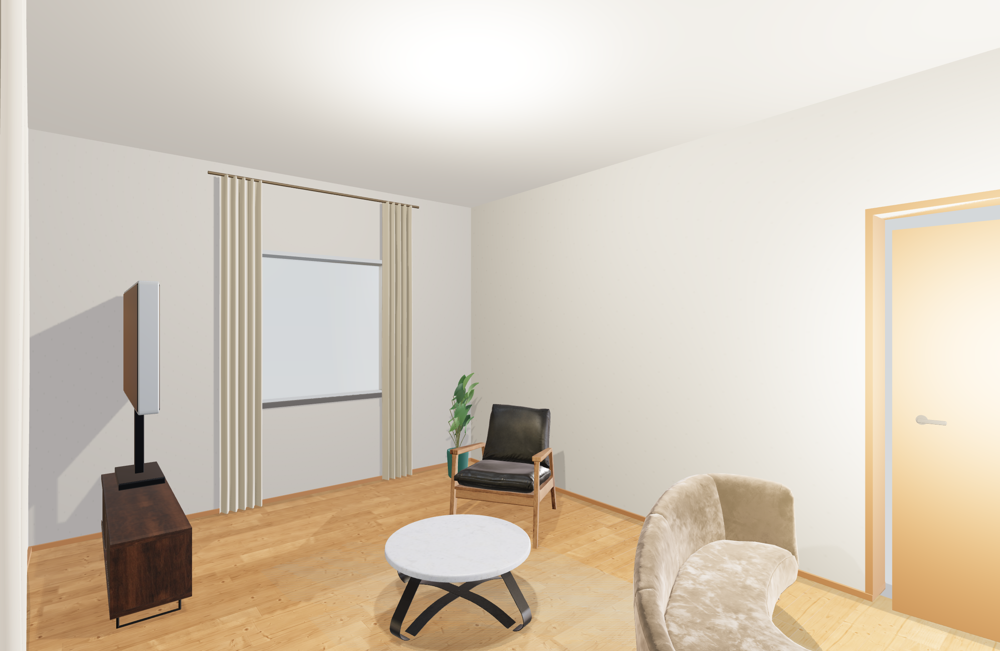

# OpenFloorPlan

一个本地优先、无需账号的 2D/3D 户型设计器。

**OpenFloorPlan is a local-first, MIT-licensed 2D/3D floor-plan editor.** Draw rooms, arrange furniture and export your project directly in the browser. No account or backend is required. The interface supports Chinese and English; use the `EN` button to switch.

Current version: `0.6.0`



上图由可编辑 3D 场景直接导出，展示实时渲染效果。

在线 Demo：[打开 OpenFloorPlan](https://bxlh009.github.io/openfloorplan/)。由 GitHub Pages 从 `main` 分支验证后部署；本地未发布的改动不会出现在在线版本中。

## 快速体验

1. 打开在线 Demo，或按下方说明启动本地版本。
2. 点击“载入”，选择仓库中的 `examples/studio-apartment.json`，体验可编辑示例。
3. 在 2D 中选择、移动家具，切换 3D 查看布局；用 `EN` / `中文` 切换语言。
4. 将项目保存为 JSON，便于备份和下次继续编辑。浏览器自动保存只保留在当前站点、当前浏览器中。

OpenFloorPlan 让用户直接在浏览器中绘制墙体、房间、门窗和家具，并实时查看 3D 预览。项目不要求后端、不上传设计文件，适合快速规划房间布局、制作平面草图和分享可复现的 JSON 项目文件。

## 功能

### 精确编辑与恢复

在 3D 预览的镜头菜单选择“室内摄影”，会切换到当前层的摄影画质，优先取景所选房间或客厅。镜头位于室内约 1.5 米高，保持竖线直立，关闭该视角下的墙体剖切并补齐顶面；摄影画质增加窗帘褶皱和织物细节。仍采用实时光栅渲染，不代表离线路径追踪或照片级效果已达标。

- 画墙预览以米显示，属性面板以厘米输入；选中墙后编辑长度或角度，完成输入后按 Tab 或点击空白处提交一次可撤销操作。
- 同层共享端点跟随墙体移动，关联门窗按沿墙相对位置同步；会拒绝让墙短于 10 cm 或已有门窗宽度的编辑。此处仍不是完整 CAD 约束求解器。
- 顶栏提供撤销与重做；“项目”面板提供完整两居示例和全部户型取景。
- 自动保存保留上一份有效草稿，重复保存不覆盖回退副本；当前草稿损坏时尝试回退，项目面板也可手动恢复并撤销恢复操作。
- 检测到另一窗口更新草稿时停止覆盖并提示先导出备份。此检查不构成跨标签页原子锁，不支持多人同时协作编辑。
- 单次导入限制为 10 MB；文件读取失败保留当前设计。自动保存与回退副本仍属于浏览器站点数据，重要设计请导出 JSON。

- 2D 画布：墙体、房间、门、窗和尺寸标注
- 七步建房流程导航：项目、楼层、结构、通行采光、房间、材质、检查输出
- 正式多楼层数据：新增、切换、复制楼层；构件按楼层隔离编辑，旧 JSON 自动迁移到 1F
- 直跑楼梯连接相邻楼层，在 2D/3D 同步表达并可调整宽度、长度、级数和方向；上升高度不超过当前层墙体高度
- 每层独立选择木地板、瓷砖或微水泥；切换会同步更新完整户型里真正可见的分房地面，不再出现按钮已变但画面未变
- 家具库：床、沙发、餐桌、衣柜、厨卫和常用家电
- 家具支持中英文搜索、可用的空间分类标签、统一 SVG 图标、无结果提示和放置时右键 90° 旋转
- 新增、旋转、改尺寸及在 2D/3D 拖动家具时统一检查楼板、墙体、硬碰撞和 25 cm 普通家具间距；地毯、墙画及成组橱柜保留合理叠放/拼接语义
- 3D 实时预览，以及 2D/3D 分屏模式
- 3D 支持“实时清爽 / 摄影暖调”双画质：编辑时保持流畅，摄影模式提高输出密度并使用本地 HDR 环境照明
- 实时/摄影模式分别使用 2048/4096 阴影图、8×/16× 纹理各向异性、ACES 色调映射和分档像素倍率；墙地与家具增加接触阴影
- 现代木地板使用 ambientCG WoodFloor040 本地 CC0 PBR 颜色、法线和粗糙度贴图，并按约 1.9 米原始扫描尺度铺贴；程序材质仅作加载失败降级
- 现代客厅使用本地圆形石材茶几、木质电视柜、现代扶手椅和真实商品级绒面沙发 glTF；沙发固定为中性 Champagne 材质变体，失败时才退回程序模型
- 浅橡木、暖橡木、深胡桃木使用现代长板比例；另有 120×60 cm 洞石、60×60 cm 象牙白瓷砖、80×80 cm 浅色水磨石和低接缝微水泥
- 墙面提供暖白、粉色、鼠尾草绿三种灰泥、60×30 cm 卫浴墙砖和通高木格栅，门窗分段处保持连续纹理相位
- 所有家具生成后统一检测最低可见几何点并归零到当前层地面，避免电视、软边家具等因各自建模基准不同而悬空
- 高清 PNG 按当前画质输出 1.5×/2× 分辨率，并以 1600 万像素预算避免浏览器显存失控
- 日光、暖夜、棚拍三套独立灯光环境；眼平、鸟瞰、等距、外观四套镜头，并可保存/恢复一个自定义视角
- 每层可设置参数化吊顶、下吊高度、环形灯带和最多 12 个筒灯；查看某层内部时自动隐藏该层顶板
- 八种真实尺度表面材质可应用到楼层地面、墙体或家具，并可从所选对象吸取后刷到其他对象；墙面饰面与通用材质互斥，避免视觉上无效
- 一键生成可编辑的完整现代两居：客厅、厨房餐厅、走廊、主卧、次卧和卫生间由入户门与室内门形成真实动线；2D 自动完整取景并标注房间名称
- 客厅、卧室、餐厅、书房、厨房、卫生间六种单房间模板仍可独立追加，生成后可逐项编辑、撤销和保存
- 3D 按房间渲染独立地面材质，厨房、卫生间和卧室不再被一整片相同木地板混为一个空间
- 3D 可在“整栋楼”和“当前层”之间切换；整栋模式按真实标高叠放所有楼层并自动取景
- JSON 项目保存和载入
- 修改后自动保存到当前浏览器，并在重新打开页面时恢复；JSON 导出仍用于备份和跨设备迁移
- 门窗在 3D 墙体上生成真实开洞
- 3D 默认剖切近侧墙，可一键切回完整外观；门扇与 2D 开启方向一致
- 家具可在 2D 直接选择；3D 中双击家具选中，拖动已选家具会实时同步到 2D 并支持撤销
- 家具和楼梯在放置及 2D/3D 拖动时可吸附墙边、相邻物件边缘/中心线和附近网格，并显示参考线；可随时关闭自动吸附
- 标注工具提供起点、终点和实时长度预览；门窗可调整尺寸、离地高度和沿墙位置
- 六套全屋风格联动门窗与家具；选中单扇门或单件家具后还能独立切换，门框比例、门叶造型、材色和家具比例都会变化
- SVG 平面图导出
- 中文 / English 双语界面：点击右上角 `EN` / `中文` 切换，语言偏好保存在浏览器
- 键盘快捷键：`V` 选择、`W` 墙、`D` 门、`F` 窗、`R` 房间、`M` 标注、`Delete` 删除、`1/2/3` 切换视图

## 本地运行

需要 Python 3.10+。

```powershell
git clone https://github.com/bxlh009/openfloorplan.git
cd openfloorplan
python serve.py
```

然后打开 `http://localhost:8080/`。也可以使用任意静态文件服务器提供项目根目录。

项目将 Three.js 0.160.0 固定在 `js/vendor/three.min.js`，因此下载仓库后可以离线运行。许可信息见 `THIRD_PARTY_NOTICES.md`。

## 项目结构

```text
index.html       页面结构和工具栏
css/style.css    界面样式
js/state.js      项目状态和 JSON 序列化
js/project.js    JSON v3、楼层/楼梯、灯光镜头、材质尺度、家具落地、房间模板、旧文件迁移和撤销事务
js/draw2d.js     2D 画布渲染
js/view3d.js     Three.js 3D 预览
js/tools.js      鼠标和键盘交互
js/ui.js         属性面板、文件操作和视图切换
js/app.js        应用启动
js/i18n.js       中文 / English 界面文案与语言切换
js/vendor/       固定的第三方运行时依赖
serve.py         本地开发服务器
```

## 数据与隐私

设计数据只在浏览器内处理。修改后的项目会自动保存在当前浏览器的本地存储中，保存和载入 JSON 文件可用于备份与迁移；项目没有账号系统、云端数据库或遥测服务。清除浏览器站点数据会删除自动保存的草稿，因此重要项目仍应导出 JSON 备份。

本工具用于空间布局和装修概念设计，不执行结构计算、消防审查、当地建筑规范校验、报批或施工图设计。楼梯和楼层默认值必须由当地专业人员复核后才能用于施工。

当前“摄影暖调”已经使用本地 HDR 环境和 PBR 家具，但仍属于浏览器实时光栅渲染，不是 Sweet Home 3D 照片生成器那类离线全局光照/路径追踪。达到照片级真实感还需要更完整的一致风格资产库、间接光照或独立离线渲染链路。

## 开发与验证

需要 Node.js 22+。核心应用没有需要安装的 npm 依赖。提交前运行：

```powershell
npm run verify
python -m py_compile serve.py
```

`verify` 运行语法检查和自动化回归；GitHub PR 检查和 Pages 发布前使用同一入口。发布包包含模型、材质、HDR 与第三方许可说明。

若受限执行环境阻止 Node 创建测试子进程并报 `spawn EPERM`，可运行 `node --test --test-isolation=none tests/*.test.js` 完成同进程测试。该方式不代表浏览器视觉验收。

界面变更还需运行 `npm run test:visual`；先检查 `tests/visual-smoke.mjs` 的浏览器和服务依赖，并按本地环境准备。纯逻辑测试通过不代表真实浏览器、在线 Demo 或发布验收通过。

## 贡献

请阅读 `CONTRIBUTING.md`。不要提交真实住址、个人户型图或其他敏感资料。

## 示例项目

`examples/studio-apartment.json` 是一个可直接载入的示例户型。启动本地服务器后，点击“载入”选择该文件即可。

## 许可证

MIT，见 `LICENSE`。
